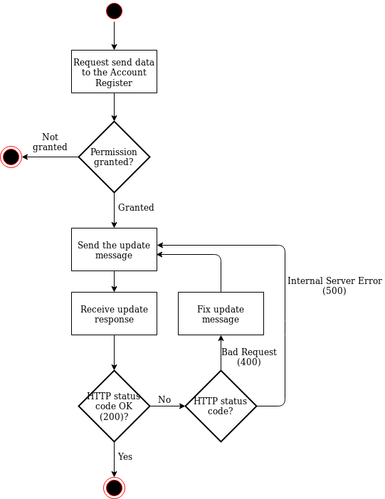
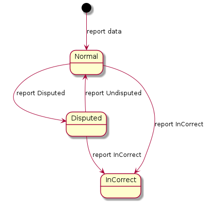

[Käyttöönoton ja ylläpidon ohje](instructions/Käyttöönoton_ja_ylläpidon_ohje_Tilirekisteri.pdf)  
[Deployment and maintenance instructions for the Bank and Payment Account Register](instructions/Deployment_and_maintenance_instructions_for_the_Bank_and_Payment_Account_Register_EN.pdf)  
[Data updating interface description](index_en.md)  
[Instruktioner för produktionssättning och underhåll av bank- och betalkontoregistret](instructions/Instruktioner_för_produktionssättning_och_underhåll_av_bank_och_betalkontoregistret_SV.pdf)  
[Beskrivning av Kontoregistrets uppdateringsgränssnitt](index_sv.md)

# Data updating interface description of the Account Register

*Document version 3.0.2*

## Version history

Version|Date|Description|
---|---|---
1.0|21.10.2019|Version 1.0|
1.0.1|29.1.2020|JSON schema’s privatePerson object’s firstName and lastName properties were combined into fullName property|
1.0.2|3.2.2020|Nationality of a natural person was changed to a list of nationalities|
1.0.3|3.2.2020|In the organisation characteristics, businessId was changed to registrationNumber and businessIdCountryCode was deleted|
1.0.4|5.3.2020|Requirements for message level signature were updated. PKI and its description were added. The maximum message size for the interface was updated and the description of the provision of information to the Account Register was updated. Reporting on disputable/incorrect details was specified.|
1.0.5|12.5.2020|An example concerning request/response was added to clarify the use of JWT tokens and HTTP headers.|
1.0.6|13.5.2020|“Signature certificate of incoming messages” was removed from section 3.1.|
1.0.7|13.5.2020|The mandatory status of the start date of the beneficiary role was removed from the schema.|
1.0.8|5.6.2020|The minimum number of roles in connection with the account and the safety deposit box was set to 1 in the schema.|
1.0.9|11.6.2020|The description of the JWS signature in section 3.4 was updated.|
1.0.10|20.8.2020|The maximum size of the message and the mention of consecutive sending were updated in section 3.6.|
1.0.11|24.8.2020|A specifying note regarding the lengths of keys used in data communications and message signatures was added.|
1.0.12|1.9.2020|An addition was made to chapter 4, specifying that all roles that are valid at that moment in time must be sent with the role lists. The list of contents was updated.|
1.0.13|2.9.2020|A mention that the sub field of the signatures must correspond to the contents of the serialnumber field of the certificate was added to section 3.4.|
1.0.14|1.10.2020|Specified information on submitting certificates containing public keys to Customs in section 3.4.|
1.0.15|18.3.2021|Requirement that the user of the interface must send at least one minimal message during a specific time period was removed from chapter 4. Replaced Population Register Centre with Digital And Population Data Services Agency.|
1.0.16|16.8.2021|Specified the use of senderBusinessId.|
2.0.00|25.1.2022|New updating interfaces, JSON schemas and example messages in accordance with the data supplier categories were added. CorrelationId was added to messages for reporting data as incorrect or disputable, so that a certain version of a detail can be reported as incorrect or disputable. JSON schemas were added to messages for reporting data as incorrect or disputable. The list of HTTP responses was specified.|
2.0.1|4.4.2022|Removed references to interface v1 in chapters 4.4 ja 4.5.|
3.0.0|23.5.2022|Added v3 update interfaces, JSON schemas and example messages.|
3.0.1|16.12.2022|Added information about limitations to subchapter 4.8. Added max length limitations to a few fields in the schema.|
3.0.2|19.6.2023|Removed references to interface version 2 in chapters 4.4, 4.5 and 4.6.|


## Table of contents

1. [Introduction](#chapter1)  
  1.1 Terms and abbreviations  
  1.2 Purpose and scope of the document  
  1.3 General description  
2. [Description of activities](#chapter2)  
  2.1 Provision of bank and payment account details to the Account Register 
3. [Information security](#chapter3)  
  3.1 Identification  
  3.2 Protecting the connections  
  3.3 Permitted HTTP-version  
  3.4 Message-level signature  
  3.5 Duty to report information security deviations  
  3.6 Capacity of the interface  
4. [General description of the account register updating interface](#chapter4)  
  4.1 General  
  4.2 Data supplier categories  
  4.3 Reporting data as incorrect or disputable  
  4.4 Interfaces  
  4.5 JSON schemas  
  4.6 Example messages  
  4.7 HTTP responses  
  4.8 Limitations  
5. [Clarifications to definitions](#chapter5)  
  5.1 Customership  
  5.2 Lawyer's customer asset account  

## 1. Introduction <a name="chapter1"></a>

### 1.1 Terms and abbreviations

Abbreviation or term|Description
---|---
Inteface|A standard practice or connection point that allows the transfer of information between devices, programmes and the user.
WS (Web Service)|Software operating in a network server, providing services for use by applications through standardised internet connection practices. The services provided by the Account Register include the provision of information,  information request and information query. The data retrieval system provides information queries as a service.
Endpoint|An interface service available at a certain network address.
REST|(Representational State Transfer) an architecture model based on HTTP for implementing programming interfaces.
JSON|(JavaScript Object Notation) open standard file format for conveying information.
PKI|Public key infrastructure. An electronic signature based on PKI is created so that a hash is created of the information to be signed (using a hash algorithm), and the hash is encrypted using the private key of the key pair. The encrypted hash is stored together with the signed information or electronic document, or conveyed to the recipient of information in some other way. The recipient encrypts the hash using the public key of the key pair, forms again a hash of the information in the message or document and compares it with the hash appended to the signature. The contents of the message are unchanged if the two hashes match. (Guidelines on the Information Security of e-Services)

### 1.2 Purpose and scope of the document

This document is the interface description of the data updating interface of the bank and payment account register.

### 1.3 General description

This document is part of the regulation issued by Finnish Customs regarding a bank and payment account monitoring system. The purpose of the document is to issue instructions to data suppliers regarding implementation of the data updating interface of the Bank and Payment Account Register (hereinafter “the Account Register”). This document is supplemented by the Deployment and maintenance instructions for the Bank and Payment Account Register.

The system consists of two parts: the Bank and Payment Account Register and the data retrieval system.

This document describes the data updating interface of the Account Register.

## 2. Description of activities <a name="chapter2"></a>

This chapter presents the provision of bank and payment account details as a flow diagram.

### 2.1 Provision of bank and payment account details to the Account Register

Upon first update, all details are provided to the Account Register. After this, upon following updates, only the updated or new details are provided daily.

Figure 2.1 shows the provision of bank and payment account details to the Account Register as a flow diagram.

  
*__Figure 2.1.__ Provision of bank and payment account details*

The figure shows that the updating interface is synchronous. The body of the HTTP response informs either of a successful update or of an error, for example, in message validation.

## <a name="chapter3"></a> 3. Information security
  
### 3.1 Identification

#### Signature certificate of outgoing messages

The outgoing messages must be automatically signed using x.509 (version 3) server certificate showing the Business ID or VAT identifier of the data supplier concerned. Acceptance of the signature requires that

either

a) the certificate was issued by the Digital and Population Data Services Agency, the certificate is valid and is not included in the certificate revocation list of the Digital and Population Data Services Agency, and the serialNumber attribute of the Subject field of the certificate consists of the Business ID or VAT number of the data supplier

or

b) the certificate is an eIDAS-approved website identification certificate, the certificate is valid and is not included in the certificate revocation list of party providing the certificate, and the organizationIdentifier attribute of the Subject field of the certificate consists of the Business ID or VAT number of the data supplier.

Please note: For the message signatures to meet the information security requirements of the National Cyber Security Centre referred to below, the RSA public key of the certificate used for signatures must have at least 3072 bits. The uses of the certificate used for signatures must also include “digital signature”. These factors must be taken into account when ordering a certificate.

#### Server certificate of the data supplier or the party authorised by the data supplier

Data traffic must be protected (encryption and counterpart identification) using x.509 (version 3) certificates.

Connections must be established using a server certificate showing the Business ID or VAT identifier of the data supplier or the party authorised by the data supplier. The party authorised by the data supplier refers, for example, to a service centre which the data supplier has authorised to compile and/or send the reports on its behalf. Such authorisation must be sent to Customs in writing.

Acceptance of the signature requires that

either

a) the server certificate was issued by the Digital and Population Data Services Agency, the certificate is valid and is not included in the certificate revocation list of the Digital and Population Data Services Agency, and the serialNumber attribute of the subject of the certificate consists of the Business ID or VAT number of the data supplier or the party authorised by the data supplier

or

b) the server certificate is an eIDAS-approved website identification certificate, the certificate is valid and is not included in the certificate revocation list of party providing the certificate, and the organizationIdentifier attribute of the subject of the certificate consists of the Business ID or VAT identifier of the data supplier or the party authorised by the data supplier.

If the same Business ID or VAT number is used in the data traffic certificate and outgoing message signature certificate of the data supplier, the same certificate can be used for both purposes.

Please note: For the protection of data communications to meet the information security requirements of the National Cyber Security Centre referred to below, the RSA public key of the certificate used must have at least 3072 bits. This must be taken into account when ordering a certificate.

#### Server certificate of the Account Register

The data supplier will identify the counterpart of the connection as the Account Register on the basis of the server certificate provided that  
a) the server certificate of the party maintaining the Account Register (Customs) was issued by the Digital and Population Data Services Agency, the certificate is valid and is not included in the certificate revocation list maintained by the Digital and Population Data Services Agency  
b) the serialNumber attribute of the subject of the certificate is “FI02454428” or “0245442-8”.

### 3.2 Protecting the connections

The connections of the Account Register data updating interface must be protected with TLS encryption using version 1.2 or later of the TLS protocol. Both ends of the connection are identified with the server certificates described above, using two-way handshaking. The connection must be established using the ephemeral Diffie-Hellman (DHE) key exchange protocol where a new unique private encryption key is created for each session. The purpose of this procedure is to ensure that encryption has the forward secrecy feature so that possible discovery of the encryption key would not subsequently lead to a disclosure of the encrypted information.

The cryptographic algorithms used in TLS encryption must have a cryptographic strength at least equal to the cryptographic strength requirements specified by the Finnish Transport and Communications Agency Traficom for national protection level ST IV. The current strength requirements are described (in Finnish) in the document https://www.kyberturvallisuuskeskus.fi/sites/default/files/media/regulation/ohje-kryptografiset-vahvuusvaatimukset-kansalliset-suojaustasot.pdf (Dnro: 190/651/2015).

### 3.3 Permitted HTTP-version

The connections of the data updating interface use HTTP version 1.1.

### 3.4 Message-level signature

The data updating interface messages are signed using JWS signatures (PKI). The RS256 algorithm is used for JWS signatures, and they are done with the sender’s private key. The deployment and maintenance instructions for the Bank and Payment Account Register contain information on submitting certificates containing public keys to Customs.

The cryptographic algorithms used in signatures must have a cryptographic strength at least equal to the cryptographic strength requirements specified by the Finnish Transport and Communications Agency Traficom for national protection level ST IV. The current strength requirements are described (in Finnish) in the document https://www.kyberturvallisuuskeskus.fi/sites/default/files/media/regulation/ohje-kryptografiset-vahvuusvaatimukset-kansalliset-suojaustasot.pdf (Dnro: 190/651/2015).

The updating message must have two separate JWS signatures (examples below):  
a) Authorization header must have Bearer token JWS containing the sender’s Business ID or VAT number in the sub claim.  
b) Request body must have JWS, where “reportUpdate” property contains the update message in accordance with [JSON Schema](#JSONschemas). 

The sub fields of both these JWS signatures must contain the sender’s Business ID or VAT number in the same format as in the SERIALNUMBER field of the sender’s public certificate.

A report on a message as incorrect or suspected to be incorrect differs from an updating message in that “reportUpdate” claim is completely left out and instead, either “reportDisputable” or “reportIncorrect” is used, depending on the situation ([see General description of the account register updating interface](#chapter4)).

a) Authorization header JWS:

JWT Header
```
{
  "alg": "RS256",
  "typ": "JWT"
}
```
JWT Payload
```
{
  "sub": "[SUBJECT]",
  "aud": "accountRegister"
}
```

b) Request body JWS:

JWT Header
```
{
  "alg": "RS256",
  "typ": "JWT"
}
```
JWT Payload
```
{
  "sub": "[SUBJECT]",
  "aud": "accountRegister",
  "reportUpdate": "[JSON OBJECT]"
}
```
### 3.5 Duty to report information security deviations

The user of the interface is obliged to immediately report to both the party issuing the certificate and Customs any cases of the certificates or their secret keys having been compromised.

The user of the interface is also obliged to immediately report to Customs any information security deviations observed in the information system using the interface.

### 3.6 Capacity of the interface

The maximum permissible size of messages to the interface is 50kB in JWT format. The messages shall be sent consecutively, so that the sender waits for the acknowledgement (OK) of the previous request before sending the next one.

## <a name="chapter4"></a> 4. General description of the account register updating interface

### <a name="general"></a> 4.1 General

The updating interface will be implemented using the REST/JSON method.

Each message must include its date of creation.

Each message must include the Business ID or VAT identifier of the supplier of information in the senderBusinessId field.

In the message structure of the updating message, legal persons, customers, accounts and safety deposit boxes are indicated as key-value pairs where a unique UUIDv4 (Universally unique identifier) is used as the key for the record. These identifiers are not issued by Customs; instead, they are identifiers created by the data suppliers for identifying customer details. This identifier allows the records to be identified, for example if the person’s name or personal identity code changes. An example of the message structure of an updating message is found [here](#examplemessages).

The updating messages can be used to send whole records that refer to unique identifiers that have previously been sent for the record. For example, data can be sent concerning an account that contains references to roles in LegalPerson records that have previously been sent. It is also possible to send only a change of name as regards a LegalPerson record without having to send the role data concerning the LegalPerson record again in the message.

However, it should be noted that when sending role lists for Account, for SafetyDepositBox or for the record Organisation, the role lists must always be complete. In other words, it is not possible to send only new roles in e.g. the Account.roles field; instead, all roles valid at that moment in time must be sent.

The messages are identified by X-Correlation-IDs (UUIDv4) which are transmitted in the message headers. If it is not included in the message sent, it is generated automatically and returned in the reply message.

### Notation

The following notation is used for describing the structure of interface records:
```
Object {
  record                    datatype
}
```

### <a name="categories"></a> 4.2 Data supplier categories

The parties obliged to provide data are divided into two categories:

Category 1: credit institutions  
Category 2: payment institutions, electronic money institutions and virtual currency providers
The content of the updating messages is described in the [JSON schemas](#JSONschemas).

### <a name="incorrectdisputable"></a> 4.3 Reporting data as incorrect or disputable

Records provided can be reported as either incorrect or suspected to be incorrect (disputable). The UUIDv4 that is unique for the record and the unique X-Correlation-ID of its updating message with which the record has been reported are used for this. The record to which the record identifier refers can be an account, a safety deposit box or a legal person. The example messages are listed [here](#examplemessages).

The data supplier in both categories use the same interfaces to report data as incorrect or disputable.

The report of a record as disputable can be cancelled if it is found to be unnecessary, but the status of a record reported as incorrect can no longer be changed.

  
*__Kuva 4.3.__ Changing the status of a record*

### <a name="interfaces"></a> 4.4 Interfaces

The interface endpoints are listed in the table below.

|HTTP-method|Path|Purpose and functionality|
|---|---|---|
POST|/v3/report-update/cat-1/|Credit institutions (by exemption granted by the Financial Supervisory Authority) use this endpoint for sending the details of customers, accounts and safety deposit boxes to the Account Register.|
POST|/v3/report-update/cat-2/|Payment institutions, electronic money institutions and virtual currency providers use this endpoint for sending the details of customers and accounts to the Account Register.|
POST|/v3/report-disputable/|Used for reporting a certain detail provided earlier as possibly incorrect/disputable. Using this endpoint, a disputability can also be removed, if the detail is found to be correct. If a detail reported as disputable is found to be incorrect, this will be reported using POST /v3/report-incorrect/.|
POST|/v3/report-incorrect/|Used for reporting a certain detail provided earlier as incorrect. When a detail marked as disputable is reported as incorrect, the disputability will be interpreted as solved, and the detail will be interpreted as incorrect.|

### <a name="JSONschemas"></a> 4.5 JSON schemas

Schemas in accordance with JSON Schema draft 7 have been created for message validation.

Updating message v3 (credit institutions) [schema](schemas/information_update-v3-credit_institution.json)

Updating message v3 (payment institutions, electronic money institutions and virtual currency providers) [schema](schemas/information_update-v3-other.json)

Reporting a detail as disputable [schema](schemas/report_disputable.json)

Reporting a detail as incorrect [schema](schemas/report_incorrect.json)

### <a name="examplemessages"></a> 4.6 Example messages

You can find the example messages via the links below:

[Updating message v3 (credit institutions)](examples/report-update-v3-credit_institution.json)

[Updating message v3 (payment institutions, electronic money institutions and virtual currency providers)](examples/report-update-v3-other.json)

[Reporting a detail as disputable](examples/report-disputable.json)

[Reporting a detail as incorrect](examples/report-incorrect.json)

### <a name="httpresponses"></a> 4.7 HTTP responses

The system returns the following HTTP responses:

200 OK

400 Bad Request

Body
```
{
  message              string
  objectErrors         string-taulukko
  fieldErrors          string-taulukko   
}
```

403 Forbidden

Body
```
{
  message              string
}
```

404 Not Found

Body
```
{
  message              string
}
```

405 Method Not Allowed

500 Internal Server Error

Body
```
{
  message              string
}
```

### <a name="Limitations"></a> 4.8 Limitations

Data about accounts or safe deposit boxes closed or customer relationships ended before 1 September 2020 should not be transmitted through the Account Register. Similarly, data about beneficiaries and other roles related to the aforementioned should not be transmitted if the role ended before 1 September 2020.

## <a name="chapter5"></a> 5. Clarifications to definitions

### <a name="customership"></a> 5.1 Customership
Customership refers to the whole time period a legal person has been the customer of the data supplier. Customership begins for example when the first account is opened. Respectively customership would end when the customer's last account is closed.

### <a name="customerassetaccount"></a> 5.2 Lawyer's customer asset account
Accounts that are lawyer's customer asset accounts are separated from other accounts by using the account purpose (AcctPurp) field with value "customer_asset_account". Lawyer's customer asset account has at least one legal person as the account owner. The legal person can be a natural person (for example the lawyer) or an organisation (for example a lawyer's office). In addition a lawyer's customer asset account can have legal persons who have access to the account. Legal persons who only have a right for example to obtain information about the account are not reported to the account register.
