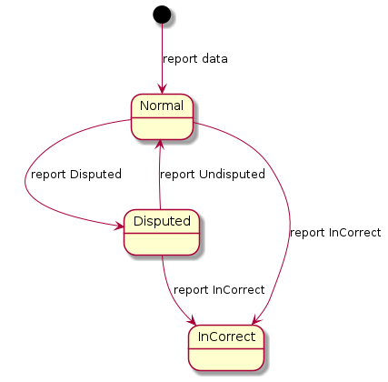

[Käyttöönoton ja ylläpidon ohje](instructions/Käyttöönoton_ja_ylläpidon_ohje_Tilirekisteri.pdf)  
[Deployment and maintenance instructions for the Bank and Payment Account Register](instructions/Deployment_and_maintenance_instructions_for_the_Bank_and_Payment_Account_Register_EN.pdf)  
[Data updating interface description](index_en.md)  
[Instruktioner för produktionssättning och underhåll av bank- och betalkontoregistret](instructions/Instruktioner_för_produktionssättning_och_underhåll_av_bank_och_betalkontoregistret_SV.pdf)  
[Beskrivning av Kontoregistrets uppdateringsgränssnitt](index_sv.md)

# Beskrivning av Kontoregistrets uppdateringsgränssnitt

*Dokumentversion 3.0.3*

## Versionshistorik

Version|Datum|Beskrivning|
---|---|---
1.0|21.10.2019|Version 1.0|
1.0.1|29.1.2020|firstName- och lastName-properties i JSON-schemats privatePerson-objekt har förenats till ett fullName-property.|
1.0.2|3.2.2020|En juridisk persons medborgarskap har ändrats till en medborgarskapslista.|
1.0.3|3.2.2020|Av organisationens egenskaper har businessId ändrats till registrationNumber och businessIdCountryCode har tagits bort.|
1.0.4|5.3.2020|Kraven gällande signaturen på meddelandenivå har uppdaterats. En PKI-förklaring har lagts till. Gränssnittets maximala meddelandestorlek och beskrivningen av hur uppgifter lämnas till Kontoregistret har uppdaterats. Precisering av hur omtvistade/felaktiga uppgifter anmäls.|
1.0.5|12.5.2020|Ett exempel på request/response har lagts till för att förtydliga användning av JWT token och HTTP header.|
1.0.6|13.5.2020|I avsnitt 3.1 har punkten Signeringscertifikat för inkommande meddelanden raderats.|
1.0.7|13.5.2020|Kravet på obligatoriskt startdatum för rollen som förmånstagare har slopats i schemat.|
1.0.8|5.6.2020|Ett minimiantal på 1 har lagts till i schemat vad gäller rollerna för kontot och bankfacket.|
1.0.9|11.6.2020|Beskrivningen av JWS-signaturen har uppdaterats i avsnitt 3.4.|
1.0.10|20.8.2020|Maximistorleken på ett meddelande och angivandet av att meddelandena ska skickas efter varandra har uppdaterats i avsnitt 3.6.|
1.0.11|24.8.2020|En preciserande anmärkning beträffande längderna på de nycklar som används i datakommunikationen och i meddelandenas signaturer har lagts till.|
1.0.12|1.9.2020|Tillägg till kapitel 4: en precisering om att alla roller som är giltiga vid tidpunkten ska skickas med rollistorna. Innehållsförteckningen har uppdaterats.|
1.0.13|2.9.2020|Tillägg till avsnitt 3.4: en notering om att sub-fältet i signaturerna ska motsvara innehållet i certifikatets serialnumber-fält.|
1.0.14|1.10.2020|Precisering i punkt 3.4. gällande inlämning till Tullen av ett certifikat som innehåller en öppen nyckel.|
1.0.15|18.3.2021|Borttag av kravet i punkt 4 på att användaren av gränssnittet ska skicka minst ett minimimeddelande inom utsatt tid. Ersättning: VRK-> DVV|
1.0.16|16.8.2021|Angav användningen av senderBusinessId.|
2.0.00|25.1.2022|Nya uppdateringsgränssnitt, JSON-scheman och exempelmeddelanden har lagts till i enlighet med kategorierna för leverantörer av uppgifter. CorrelationId har lagts till i meddelanden om anmälan av felaktig och omtvistad uppgift, då en viss version av uppgiften kan anmälas som felaktig eller omtvistad. JSON-scheman har lagts till för meddelanden om anmälan av felaktig och omtvistad uppgift. Listan över HTTP-svar har preciserats.|
2.0.1|4.4.2022|Hänvisningarna till v1-gränssnittet har tagits bort i styckena 4.4 och 4.5.|
3.0.0|23.5.2022|v3-uppdateringsgränssnitt, JSON-scheman och exempelmeddelanden har lagts till.|
3.0.1|16.12.2022|Lade till information om begränsningar i underkapitel 4.8. Lade till maxlängdsbegränsningar i några få fält i schemat.|
3.0.2|19.6.2023|Hänvisningarna till v2-gränssnittet har tagits bort i styckena 4.4, 4.5 och 4.6.|
3.0.3|1.11.2023|Preciseringar i avsnitt 3.1 i anvisningar om servercertifikat för uppgiftsleverantören.|

## Innehåll

1. [Inledning](#kapitel1)  
  1.1 Termer och förkortningar
  1.2 Dokumentets syfte och omfattning
  1.3 Allmän beskrivning  
2. [Aktivitetsbeskrivning](#kapitel2)  
  2.1 Överföring av bank- och betalkontouppgifter till Kontoregistret
3. [Datasäkerhet](#kapitel3)  
  3.1 Identifiering  
  3.2 Skydd för förbindelser
  3.3 Tillåten HTTP-version
  3.4 Signering på meddelandenivå
  3.5 Skyldighet att anmäla informationssäkerhetsincidenter
  3.6 Gränssnittets kapacitet
4. [Allmän beskrivning av kontoregistrets uppdateringsgränssnitt](#kapitel4)  
  4.1 Allmänt  
  4.2 Kategorier av leverantörer av uppgifter 
  4.3 Anmälan av uppgifter som felaktig eller omtvistad  
  4.4 Gränssnitt  
  4.5 JSON-scheman  
  4.6 Exempelmeddelanden  
  4.7 HTTP-svar  
  4.8 Begränsningar  
5. [Preciseringar av begrepp](#kapitel5)  
  5.1 Kundrelation  
  5.2 Gemensamt konto som förvaltas av en advokat

## 1. Inledning <a name="kapitel1"></a>

### 1.1 Termer och förkortningar

Förkortning eller term|Förklaring
---|---
Gränssnitt|Standardenlig praxis eller kontaktyta som möjliggör överföring av information mellan enheter, programvaror eller användare.
WS (Web Service)|Webbaserat datorprogram som med hjälp av standardiserade internetprotokoll ställer tjänster till förfogande för applikationerna. De tjänster som kontoregistret tillhandahåller är leverans av uppgifter samt begäran och förfrågan om uppgifter. Tjänsten som datasöksystemet tillhandahåller är förfrågan om uppgifter.
Endpoint|Gränssnittstjänst som finns tillgänglig på en viss webbadress.
REST|(Representational State Transfer) En arkitekturmodell som bygger på en HTTP-protokoll för genomförande av programmeringsgränssnitt.
JSON|(JavaScript Object Notation) Filformat för dataöverföring enligt öppen standard.
PKI|Teknik med öppen nyckel. En elektronisk signatur som bygger på teknik med öppen nyckel skapas så att det av den uppgift som signeras skapas ett kondensat (med en hash-algoritm), som krypteras med nyckelparets privata nyckel.  Det krypterade kondensatet sparas i anslutning till den signerade uppgiften eller det elektroniska dokumentet, eller så förmedlas uppgiften på ett annat sätt till mottagaren. Mottagaren dekrypterar kondensatets kryptering med nyckelparets öppna nyckel, återskapar kondensatet av meddelandets eller dokumentets uppgifter och jämför det med kondensatet som kopplats till signaturen. Meddelandets innehåll förblir oförändrat, såvida kondensaten är lika. (Anvisning om informationssäkerheten inom elektronisk ärendehantering)


### 1.2 Dokumentets syfte och omfattning

Detta dokument är en gränssnittsbeskrivning av uppdateringsgränssnittet för registret över bank- och betalkonton.

### 1.3 Allmän beskrivning

Detta dokument ingår i Tullens föreskrift om ett övervakningssystem för bank- och betalkonton. Dokumentets syfte är att instruera leverantörer av uppgifter om genomförandet av uppdateringsgränssnittet för bank- och betalkontoregistret (härefter Kontoregistret). Detta dokument kompletteras av Instruktioner för ibruktagande och underhåll av bank- och betalkontoregistret.

Systemet består av två delar: registret över bank- och betalkonton och datasöksystemet.

I detta dokument beskrivs Kontoregistrets uppdateringsgränssnitt.

## 2. Aktivitetsbeskrivning <a name="kapitel2"></a>

I detta kapitel beskrivs i form av ett flödesschema hur bank- och betalkontouppgifter överförs till Kontoregistret.

### 2.1 Överföring av bank- och betalkontouppgifter till Kontoregistret

När uppgifter överförs till kontoregistret första gången ska alla berörda uppgifter överföras till registret. Därefter överförs bara uppdaterade eller nya uppgifter dagligen.

På bild 2.1 visas överföring av bank- och betalkontouppgifter till Kontoregistret i form av ett flödesschema.

  
*__Bild 2.1.__ Överföring av bank- och betalkontouppgifter*

Av bilden framgår att uppdateringsgränssnittet är synkront. I brödtexten till ett HTTP-svar returneras antingen en uppgift om att uppdateringen lyckats eller en uppgift om fel vid exempelvis validering av meddelandet.

## <a name="kapitel3"></a> 3. Datasäkerhet
  
### 3.1 Identifiering

#### Signeringscertifikat för utgående meddelanden

Utgående meddelanden ska automatiskt signeras med servercertifikatet x.509 (version 3), av vilket uppgiftsleverantörens FO-nummer eller momsnummer ska framgå. Godkännande av signaturen förutsätter

antingen  
a) att certifikatet har utfärdats av Myndigheten för digitalisering och befolkningsdata (MDB), är i kraft och inte finns på MDB:s spärrlista och att attributet serialNumber för objektet för certifikatet är uppgiftsleverantörens FO-nummer eller momsnummer.

eller  
b) att certifikatet är ett eIDAS-godkänt identifieringscertifikat för webbplatser, är i kraft och inte finns på certifikatutfärdarens uppdaterade spärrlista och att attributet organizationIdentifier för objektet för certifikatet är uppgiftsleverantörens FO-nummer eller momsnummer.

Obs. För att meddelandenas signaturer ska uppfylla de datasäkerhetskrav från Cybersäkerhetscentret som det hänvisas till nedan ska den öppna nyckeln (RSA public key) för certifikatet som används för signaturer ha minst 3072 bitar. Användningssyftena för ett certifikat som används för signaturer ska också omfatta ”digital signatur”. Man ska beakta dessa omständigheter när man beställer ett certifikat.

#### Servercertifikat för uppgiftsleverantören eller en aktör som befullmäktigats av uppgiftsleverantören

Datakommunikationen ska skyddas (kryptering och identifiering av motpart) med x.509-certifikat (version 3).

Ett servercertifikat ska användas för att bilda en förbindelse, och FO-numret eller momsnumret för uppgiftsleverantören eller en aktör som befullmäktigats av denne ska framgå av certifikatet. Med en aktör som befullmäktigats av leverantören av uppgifter avses exempelvis en servicecentral som leverantören har befullmäktigat att upprätta och/eller skicka anmälningar. En fullmakt gällande detta ska lämnas in skriftligen till Tullen.

Godkännande av signaturen förutsätter

antingen  
a) att certifikatet har utfärdats av MDB, är i kraft och inte finns på MDB:s spärrlista och att attributet serialNumber för objektet för certifikatet är FO-numret eller momsnumret för leverantören av uppgifter eller en aktör som befullmäktigats av denne.

eller  
b) att servercertifikatet är ett eIDAS-godkänt identifieringscertifikat för webbplatser, är i kraft och inte finns på certifikatutfärdarens uppdaterade spärrlista och att attributet organizationIdentifier för objektet för certifikatet är FO-numret eller momsnumret för leverantören av uppgifter eller en aktör som befullmäktigats av denne.
Om uppgiftsleverantörens servercertifikat och signeringscertifikat för utgående meddelanden har samma FO-nummer eller momsnummer, kan samma certifikat användas för båda ändamålen.

Obs. För att meddelandenas signaturer ska uppfylla de datasäkerhetskrav från Cybersäkerhetscentret som det hänvisas till nedan ska den öppna nyckeln (RSA public key) för certifikatet som används för signaturer ha minst 3072 bitar. Användningssyftena för ett certifikat som används för signaturer ska också omfatta ”digital signatur”. Dessutom måste servercertifikatet vara av typen QWAC (Qualified Website Authentication Certificate), som innehåller tillägg (X509v3 Extended Key Usage: TLS Web Client Authentication, TLS Web Server Authentication). Man ska beakta dessa omständigheter när man beställer ett certifikat.

#### Kontoregistrets servercertifikat

Leverantören av uppgifter identifierar förbindelsens motpart som Kontoregistret på basis av ett servercertifikat, förutsatt att   
a) servercertifikatet för den som ansvarar för Kontoregistret (Tullen) har utfärdats av MDB och inte finns med på MDB:s spärrlista  
b) attributet serialNumber för certifikatets objekt är ”FI02454428” eller ”0245442-8”

### 3.2 Skydd för förbindelser

Förbindelserna i Kontoregistrets uppdateringsgränssnitt är skyddade med TLS-kryptering med TLS-protokollets version 1.2 eller högre. Båda ändarna av förbindelsen identifieras med ovan beskrivna servercertifikat genom ömsesidig TLS-autentisering. Förbindelsen ska bildas med hjälp av ett ephemeral Diffie-Hellman (DHE) -nyckelbyte där det för varje session skapas en ny unik privat krypteringsnyckel. Syftet med detta förfarande är att säkerställa krypteringens forward secrecy-egenskap så att ett röjande av krypteringsnyckeln inte leder till att den krypterade informationen röjs.

De kryptografiska algoritmer som används vid TLS-kryptering ska till sin kryptografiska styrka motsvara minst Transport- och kommunikationsverkets krav på kryptografisk styrka för den nationella skyddsnivån ST IV. De nuvarande kraven gällande styrkan beskrivs på finska i dokumentet https://www.kyberturvallisuuskeskus.fi/sites/default/files/media/regulation/ohje-kryptografiset-vahvuusvaatimukset-kansalliset-suojaustasot.pdf (Dnr: 190/651/2015).

### 3.3 Tillåten HTTP-version

Förbindelserna som används av uppdateringsgränssnittet använder version 1.1 av HTTP-protokollet.

### 3.4 Signering på meddelandenivå

Meddelanden i uppdateringsgränssnittet förses med JWS-signatur (PKI). För JWS-signaturen används algoritmen RS256 och meddelandena signeras med avsändarens privata nyckel. Anvisningar om inlämning till Tullen av certifikat som innehåller den öppna nyckeln finns i Instruktioner för ibruktagande och underhåll av bank- och betalkontoregistret.

De kryptografiska algoritmer som används i signaturen ska till sin kryptografiska styrka motsvara minst Transport- och kommunikationsverkets krav på kryptografisk styrka för den nationella skyddsnivån ST IV. De nuvarande kraven gällande styrkan beskrivs på finska i dokumentet https://www.kyberturvallisuuskeskus.fi/sites/default/files/media/regulation/ohje-kryptografiset-vahvuusvaatimukset-kansalliset-suojaustasot.pdf (Dnr: 190/651/2015).

Uppdateringsmeddelandet ska ha två separata JWS-signaturer (exemplen nedan):  
a) Authorization header ska ha Bearer token JWS av vilket avsändarens FO-nummer eller momsnummer framgår i en sub claim.  
b) Request body ska ha JWS där “reportUpdate” property innehåller ett uppdateringsmeddelande enligt JSON-schemat.

Sub-fältet i båda dessa JWS-signaturer ska innehålla avsändarens FO-nummer eller momsnummer i samma format som i SERIALNUMBER-fältet i avsändarens publika certifikat.

Anmälan om ett felaktigt meddelande eller om ett meddelande som misstänks vara felaktigt skiljer sig från uppdateringsmeddelandet så att “reportUpdate” claim lämnas bort helt och hållet och ersätts av antingen “reportDisputable” eller “reportIncorrect” beroende på situationen ([se den allmänna beskrivningen av Kontoregistrets uppdateringsgränssnitt](#kapitel4)).

a) Authorization header JWS:

JWT Header
```
{
  "alg": "RS256",
  "typ": "JWT"
}
```
JWT Payload
```
{
  "sub": "[SUBJECT]",
  "aud": "accountRegister"
}
```

b) Request body JWS:

JWT Header
```
{
  "alg": "RS256",
  "typ": "JWT"
}
```
JWT Payload
```
{
  "sub": "[SUBJECT]",
  "aud": "accountRegister",
  "reportUpdate": "[JSON OBJECT]"
}
```
### 3.5 Skyldighet att anmäla informationssäkerhetsincidenter

Den som använder gränssnittet är skyldig att utan dröjsmål underrätta såväl den som utfärdat certifikatet som Tullen om att certifikaten eller deras hemliga nycklar har äventyrats.

Den som använder gränssnittet är även skyldig att utan dröjsmål anmäla till Tullen om det observeras informationssäkerhetsincidenter i datasystemet som använder gränssnittet.

### 3.6 Gränssnittets kapacitet

Den maximala tillåtna meddelandestorleken i gränssnittet är 50kB i JWT-format. Man ska skicka meddelandena efter varandra så att man väntar tills föregående begäran kvitterats med OK innan man skickar nästa.

## <a name="kapitel4"></a> 4. Allmän beskrivning av Kontoregistrets uppdateringsgränssnitt

### <a name="allmänt"></a> 4.1 Allmänt

Uppdateringsgränssnittet implementeras med REST/JSON-metoden.

Varje meddelande ska innehålla datum då det skapats.

Varje meddelande ska innehålla uppgiftsleverantörens FO-nummer eller momsnummer i senderBusinessId-fältet.

I uppdateringsmeddelandets meddelandestruktur anmäls juridiska personer, kundrelationer, konton och bankfack som nyckel-värde-par, där nyckeln utgörs av ett individuellt id UUIDv4 (Universally unique identifier) för posten. Tullen utfärdar inte dessa id, utan de skapas av den som levererar uppgifterna och de kan användas för att specificera kunduppgifter. Utifrån detta id kan posterna identifieras, till exempel om personens namn eller personbeteckning ändras. Exempel på uppdateringsmeddelandets meddelandestruktur finns [här](#exempelmeddelanden).

I uppdateringsmeddelandena är det möjligt att skicka hela poster som hänvisar till id som tidigare skickats och som är individuella för posten. Man kan till exempel skicka uppgifter om ett konto som innehåller rollhänvisningar till LegalPerson-poster som skickats tidigare. Dessutom kan man till exempel skicka enbart en namnändring angående en LegalPerson-post, och då behöver man inte skicka rolluppgifterna som hänför sig till LegalPerson-posten på nytt i meddelandet.

Dock bör man beakta att när man skickar rollförteckningar som gäller Account, SafetyDepositBox eller posten Organisation, ska rollförteckningarna alltid vara fullständiga, dvs. det är inte möjligt att skicka enbart nya roller i t.ex. Account.roles-fältet, utan alla roller som är giltiga vid den tidpunkten ska skickas.

För specificering av meddelanden används id:t X-Correlation-ID (UUIDv4) som finns i meddelandets header. Om ett sådant inte finns i meddelandet genereras det automatiskt och returneras i svarsmeddelandet.

### Notation

För strukturerad beskrivning av gränssnittsposter används följande notation:

```
Objekt {
  post                    uppgiftstyp
}
```

### <a name="kategorier"></a> 4.2 Kategorier av uppgiftslämnare, dvs. leverantörer av uppgifter

De som är skyldiga att lämna uppgifter har indelats i två kategorier:

Kategori 1: Kreditinstitut  
Kategori 2: Betalningsinstitut, institut för elektroniska pengar och tillhandahållare av virtuella valutor.

Uppdateringsmeddelandenas innehåll beskrivs i [JSON-scheman](#JSONscheman).

### <a name="felaktigaomtvistade"></a> 4.3 Anmälan om felaktiga eller omtvistade uppgifter

Inlämnade poster kan anmälas som felaktiga eller som misstänkt felaktiga (omtvistade). För detta ändamål används identifikationen UUIDv4 som specificerar posten och uppdateringsmeddelandets unika identifikation X-Correlation-ID med vilken posten anmälts. Posten till vilken identifikationen hänvisar kan vara ett konto, bankfack eller en juridisk person. Exempel på meddelanden finns [här](#exempelmeddelanden).

Uppgiftsleverantörerna enligt båda kategorierna använder samma gränssnitt för anmälan av felaktiga eller omtvistade uppgifter.

Misstanken om felaktighet kan återkallas om misstanken konstateras vara obefogad men statusen för den post som anmälts som felaktig kan inte längre ändras.

  
*__Kuva 4.3.__ Ändring av postens status*

### <a name="gränssnitt"></a> 4.4 Gränssnitt

I följande tabell finns en lista över gränssnittets endpoints.

|HTTP-metod|Sökväg|Syfte och funktion|
|---|---|---|
POST|/v3/report-update/cat-1/|Kreditinstitut (med undantagstillstånd av Finansinspektionen) använder denna endpoint för att lämna uppgifter om kundrelationer, konton och bankfack till Kontoregistret.|
POST|/v3/report-update/cat-2/|Betalningsinstitut, institut för elektroniska pengar och tillhandahållare av virtuella valutor använder denna endpoint för att lämna uppgifter om kundrelationer och konton till Kontoregistret.|
POST|/v3/report-disputable/|Används för att anmäla att en viss, tidigare lämnad uppgift eventuellt är felaktig/omtvistad. Med denna endpoint kan man även häva uppgiftens omtvistade status om uppgiften visar sig vara korrekt. En uppgift som anmälts som omtvistad anmäls som faktiskt felaktig med POST /v3/report-incorrect/.|
POST|/v3/report-incorrect/|Används för att anmäla att en viss, tidigare lämnad uppgift är felaktig. När en felaktighet anmäls i en uppgift som anmälts som omtvistad, tolkas frågan om uppgiftens omtvistade status som löst och uppgiften tolkas som felaktig.|

### <a name="JSONscheman"></a> 4.5 JSON-scheman

För validering av meddelanden har man skapat scheman enligt JSON Schema draft 7:

Uppdateringsmeddelande v3 (kreditinstitut) [schema](schemas/information_update-v3-credit_institution.json)

Uppdateringsmeddelande v3 (betalningsinstitut, institut för elektroniska pengar och tillhandahållare av virtuella valutor) [schema](schemas/information_update-v3-other.json)

Anmälan om omtvistad uppgift [schema](schemas/report_disputable.json)

Anmälan om felaktig uppgift [schema](schemas/report_incorrect.json)

### <a name="exempelmeddelanden"></a> 4.6 Exempelmeddelanden

Exempelmeddelandena finns under länkarna nedan:

[Uppdateringsmeddelande v3 (kreditinstitut)](examples/report-update-v3-credit_institution.json)

[Uppdateringsmeddelande v3 (betalningsinstitut, institut för elektroniska pengar och tillhandahållare av virtuella valutor)](examples/report-update-v3-other.json)

[Anmälan om omtvistad uppgift](examples/report-disputable.json)

[Anmälan om felaktig uppgift](examples/report-incorrect.json)

### <a name="HTTPsvar"></a> 4.7 HTTP-svar

Systemet returnerar följande HTTP-svar:

200 OK

400 Bad Request

Body
```
{
  message              string
  objectErrors         string-taulukko
  fieldErrors          string-taulukko   
}
```

403 Forbidden

Body
```
{
  message              string
}
```

404 Not Found

Body
```
{
  message              string
}
```

405 Method Not Allowed

500 Internal Server Error

Body
```
{
  message              string
}
```

### <a name="Begränsningar"></a> 4.8 Begränsningar

Uppgifter om konton och bankfack som har spärrats före den 1 september 2020 och uppgifter om kundrelationer som upphört före denna dag ska inte lämnas via kontoregistret. Detsamma gäller för uppgifter om förmånstagare och andra roller som har anknytning till de ovannämnda, om rollen har upphört före den 1 september 2020.

## <a name="kapitel5"></a> 5. Preciseringar av begrepp

### <a name="kundrelation"></a> 5.1 Kundrelation

Kundrelationen avser hela den period då en juridisk person varit kund hos en leverantör av uppgifter. Kundrelationen börjar till exempel när det första kontot öppnas. På motsvarande sätt upphör kundrelationen när kundens sista konto stängs.

### <a name="klientmedelskonto"></a> 5.2 Gemensamt konto som förvaltas av en advokat (klientmedelskonto)

Konton som är gemensamma konton som förvaltas av en advokat skiljs åt från andra konton genom att man i fältet för kontots användningsändamål (AcctPurp) använder värdet ”customer_asset_account". Ägaren till ett gemensamt konto som förvaltas av en advokat är minst en juridisk person som kan vara en fysisk person (t.ex. advokat) eller en organisation (t.ex. advokatbyrå). Därtill kan det finnas juridiska personer som har rätt att använda ett sådant konto. De som bara har t.ex. rätt att få uppgifter gällande kontot anmäls inte till Kontoregistret.
